# One prompt, twelve renderings

A controlled experiment in how different language models, paired with different design skills, interpret the **same one-page portfolio brief**.

Twelve runs. Same input. Twelve very different outputs.

> **Live demo:** https://franpiaggio.github.io/one-prompt-twelve-runs/

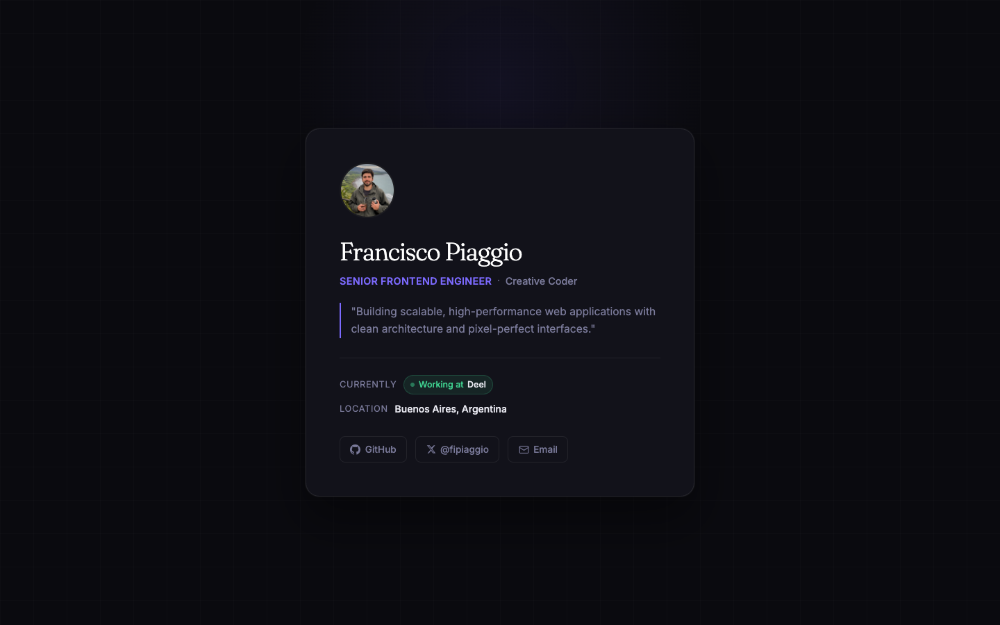

---

## What this is

Every run was generated from a single Markdown prompt (`website-demo.md`) describing the same content and hierarchy: a personal portfolio home for *Francisco Piaggio, Senior Frontend Engineer & Creative Coder, Buenos Aires*. No design direction was given. The only variables that change across runs are:

1. The **model** generating the code (Anthropic Claude, GPT, Kimi, MiniMax, GLM, Qwen).
2. The **skill stack** (i.e. the agent skill or skill combination guiding the model: `frontend-design`, `impeccable`, `high-end-visual-design`, `design-system` variants, or no skill at all).

The goal is to see how each combination reads, prioritises and translates the same brief into a real, working static site.

## The prompt

```markdown
Build a personal portfolio home page for Francisco Piaggio.

Page title: Francisco Piaggio — Frontend Engineer & Creative Coder
Meta description: Frontend engineer and creative coder from Buenos Aires, Argentina.

## Content
- Profile photo: /profile.png (alt: Francisco Piaggio)
- Name: Francisco Piaggio
- Primary role: Senior Frontend Engineer
- Secondary role: Creative Coder
- Tagline: Building scalable, high-performance web applications with clean architecture and pixel-perfect interfaces.
- Current employment: Currently working at Deel
- Location: Buenos Aires, Argentina
- Contact: GitHub, X/Twitter (@fipiaggio), Email

Content hierarchy:
- The name and identity are the most prominent element.
- name → primary role → secondary role → tagline → current company → location → contact links.

Output requirements:
- Place the site in a dedicated folder.
- In that same folder, create a README documenting the model used and the skill, if any.
```

The full prompt lives in [`website-demo.md`](./website-demo.md).

## The twelve runs

| # | Model | Skill stack | Folder |
|---|---|---|---|
| 01 | opus 4.7 | `impeccable` | [`impeccable/`](./impeccable/) |
| 02 | opus 4.7 | `high-end-visual-design` | [`high-end-visual-design/`](./high-end-visual-design/) |
| 03 | kimi k2.6 | `frontend-design` | [`kimik2.6/`](./kimik2.6/) |
| 04 | minimax m2.7 | `frontend-design` | [`miniMaxM2.7/`](./miniMaxM2.7/) |
| 05 | gpt 5.5 | `brainstorming + frontend-design` | [`gpt5.5/`](./gpt5.5/) |
| 06 | sonnet 4.6 | no skill, bare | [`sonnet4.6/`](./sonnet4.6/) |
| 07 | opus 4.7 | `design-system` (Artistic) | [`artistic/`](./artistic/) |
| 08 | opus 4.7 | no skill, bare | [`claude-opus-4-7/`](./claude-opus-4-7/) |
| 09 | glm 5.1 | `frontend-design` | [`GLM-5.1/`](./GLM-5.1/) |
| 10 | opus 4.7 | `design-system` (neobrutalism) | [`neobrutalism/`](./neobrutalism/) |
| 11 | opus 4.7 | `design-system` (Paper) | [`paper/`](./paper/) |
| 12 | qwen 3.6+ | `frontend-design` | [`qwen3.6/`](./qwen3.6/) |

### Previews

<table>
<tr>
<td align="center"><a href="./impeccable/">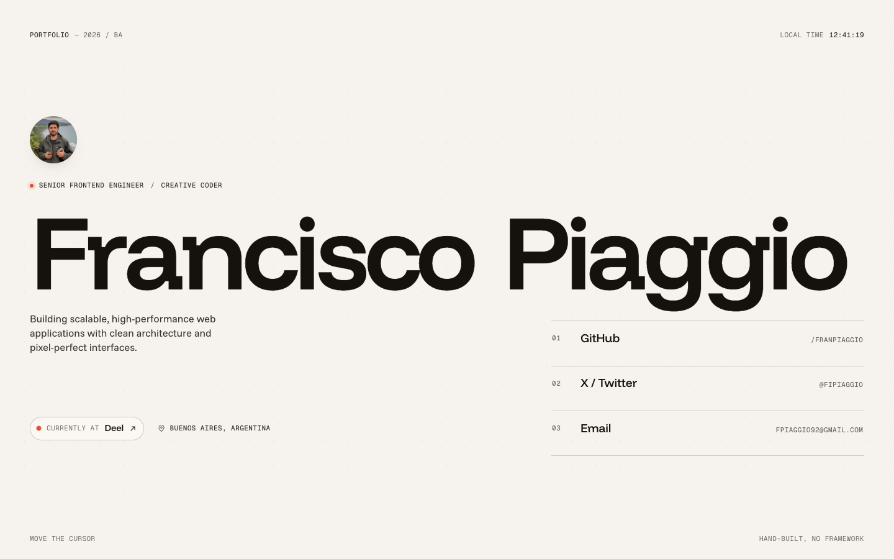</a><br/><sub><b>01 · opus 4.7 / impeccable</b></sub></td>
<td align="center"><a href="./high-end-visual-design/">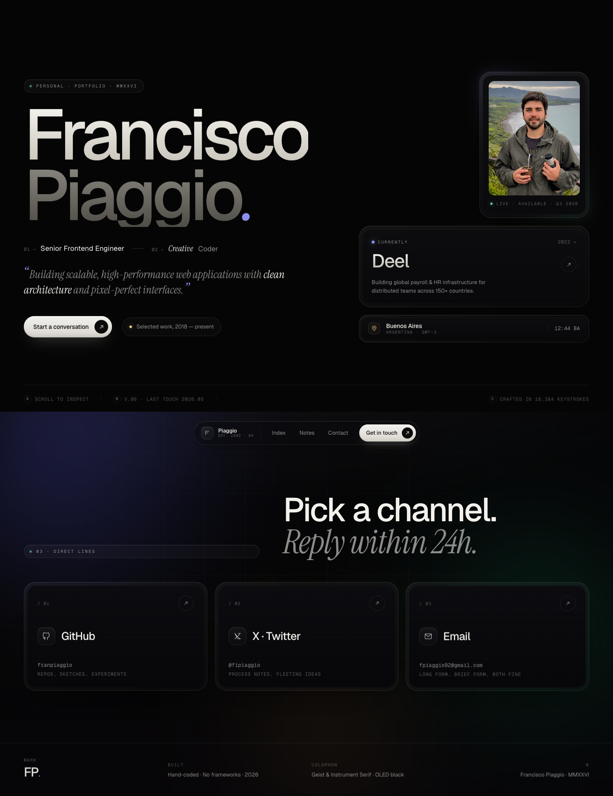</a><br/><sub><b>02 · opus 4.7 / high-end-visual-design</b></sub></td>
</tr>
<tr>
<td align="center"><a href="./kimik2.6/">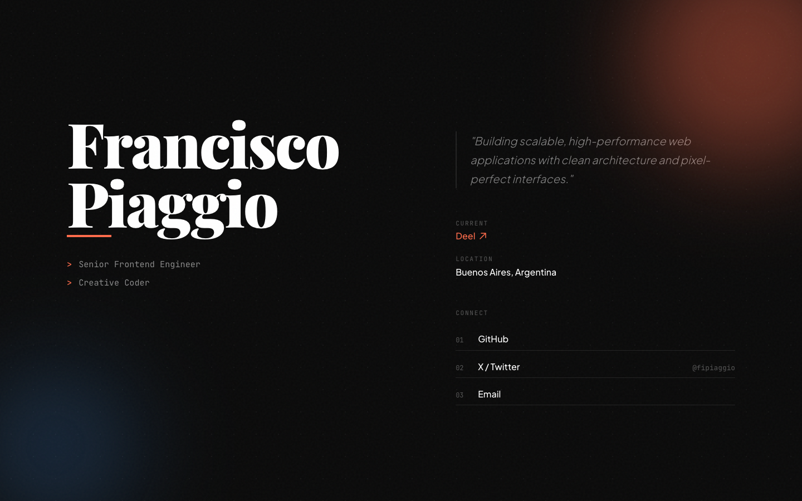</a><br/><sub><b>03 · kimi k2.6 / frontend-design</b></sub></td>
<td align="center"><a href="./miniMaxM2.7/">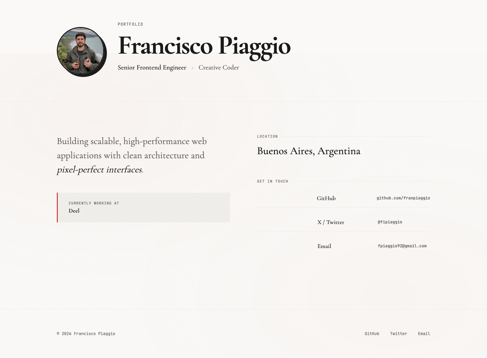</a><br/><sub><b>04 · minimax m2.7 / frontend-design</b></sub></td>
</tr>
<tr>
<td align="center"><a href="./gpt5.5/">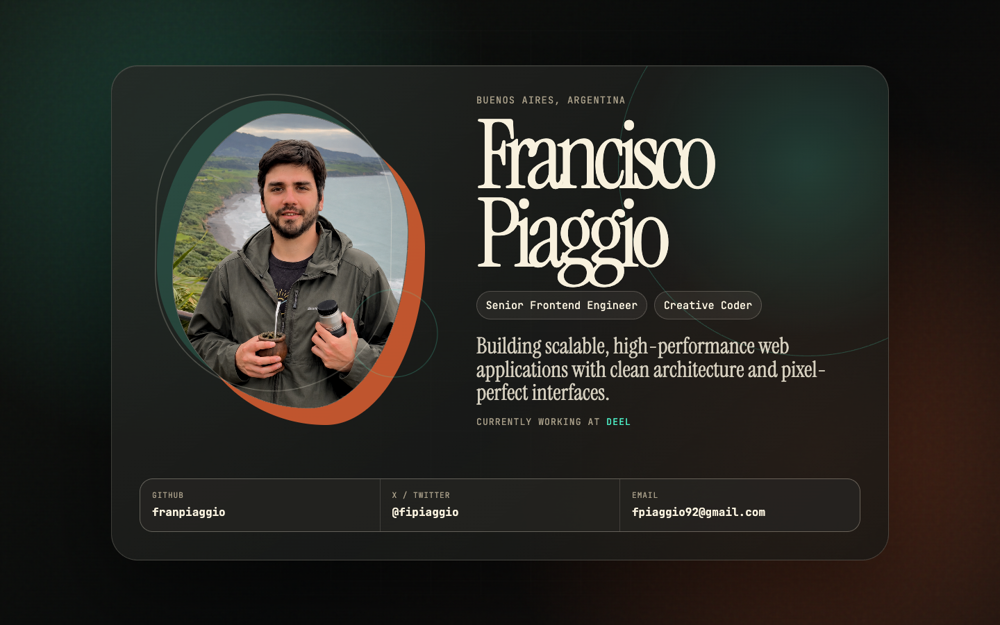</a><br/><sub><b>05 · gpt 5.5 / brainstorming + frontend-design</b></sub></td>
<td align="center"><a href="./sonnet4.6/"></a><br/><sub><b>06 · sonnet 4.6 / bare</b></sub></td>
</tr>
<tr>
<td align="center"><a href="./artistic/">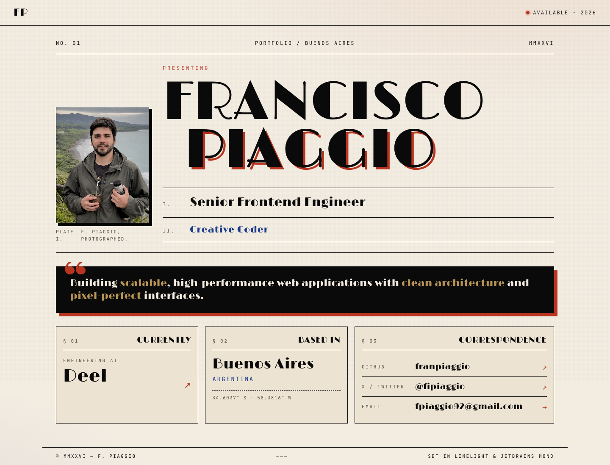</a><br/><sub><b>07 · opus 4.7 / design-system (Artistic)</b></sub></td>
<td align="center"><a href="./claude-opus-4-7/">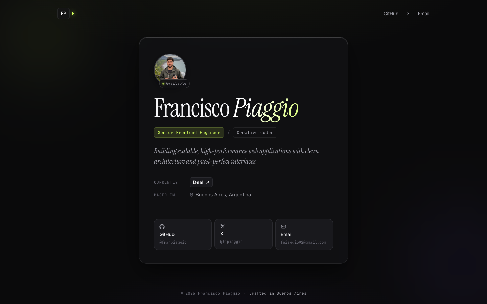</a><br/><sub><b>08 · opus 4.7 / bare</b></sub></td>
</tr>
<tr>
<td align="center"><a href="./GLM-5.1/">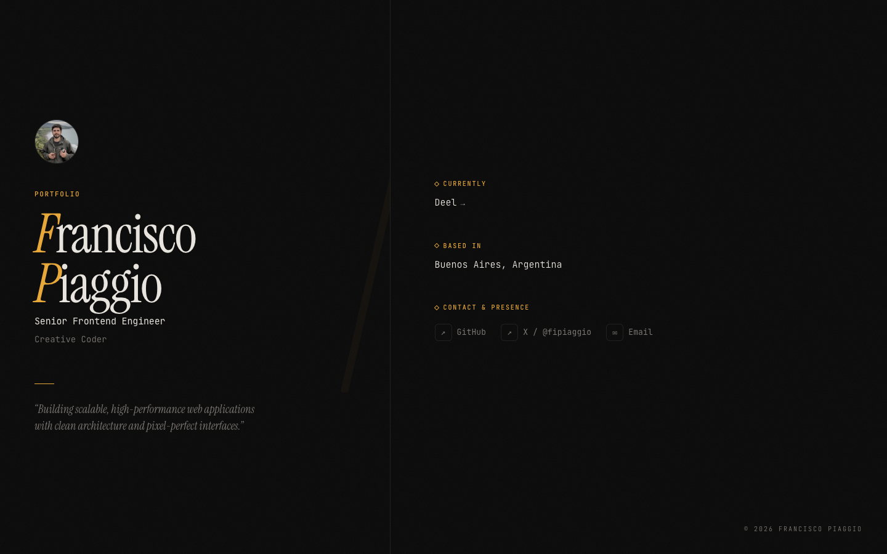</a><br/><sub><b>09 · glm 5.1 / frontend-design</b></sub></td>
<td align="center"><a href="./neobrutalism/">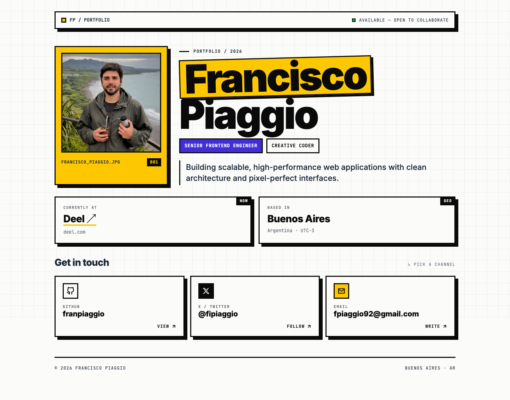</a><br/><sub><b>10 · opus 4.7 / design-system (neobrutalism)</b></sub></td>
</tr>
<tr>
<td align="center"><a href="./paper/">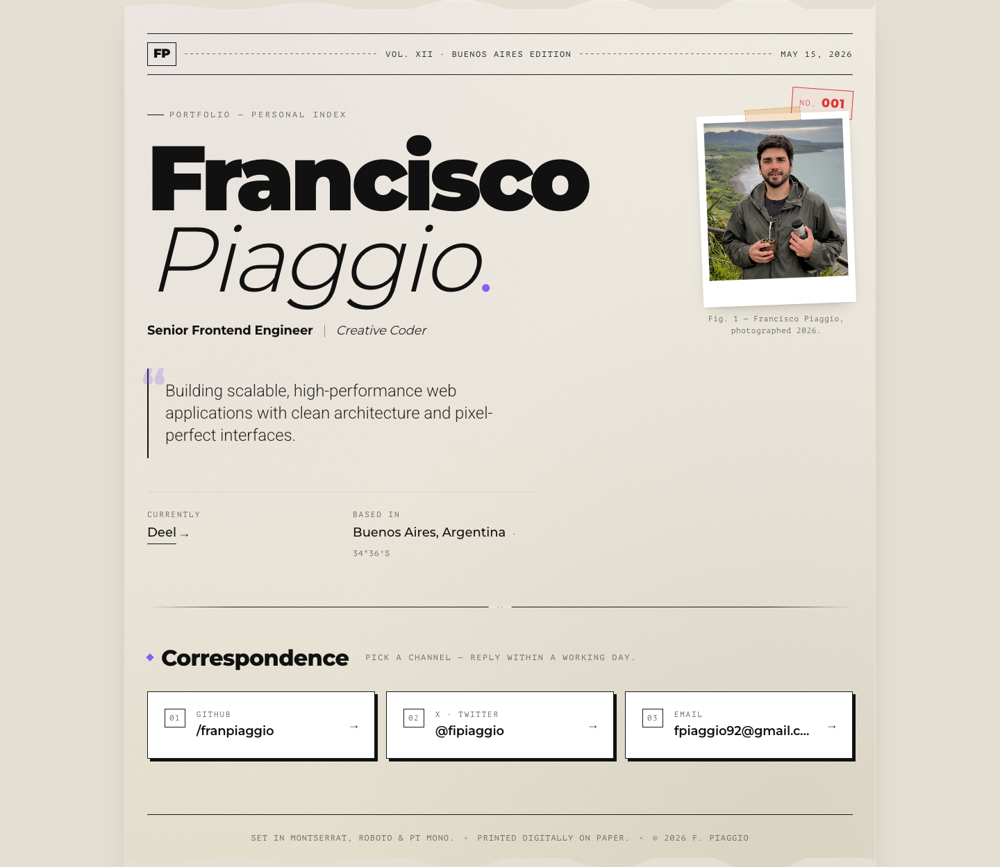</a><br/><sub><b>11 · opus 4.7 / design-system (Paper)</b></sub></td>
<td align="center"><a href="./qwen3.6/">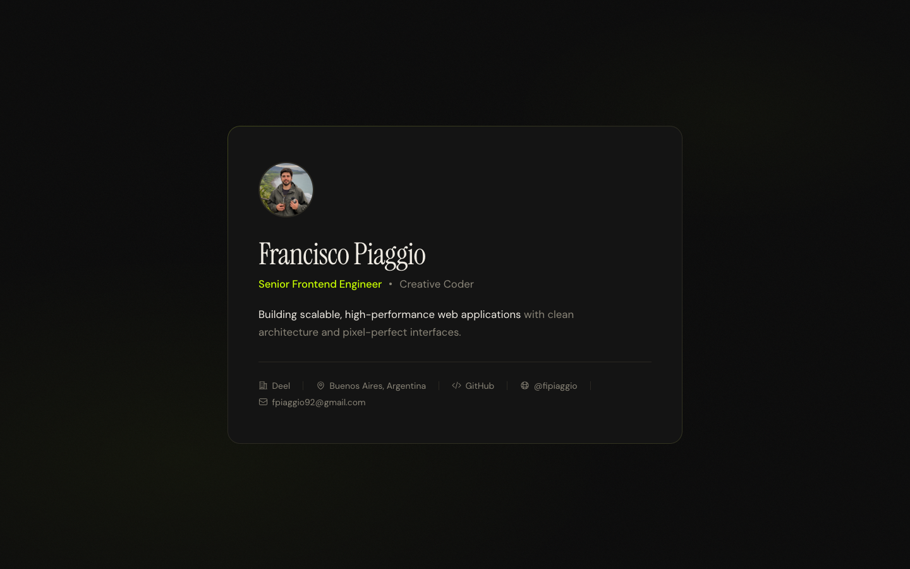</a><br/><sub><b>12 · qwen 3.6+ / frontend-design</b></sub></td>
</tr>
</table>

## Repository layout

```
.
├── index.html                  # Comparison index (entry point)
├── website-demo.md             # The prompt every run shares
├── profile.png                 # Profile photo referenced by every run
├── previews/                   # 1440×900 screenshots of each run
├── shared/
│   └── banner.js               # Bottom dock injected into every demo
└── <run-folder>/               # 12 self-contained static sites
    ├── index.html
    ├── README.md               # Model + skill used for that run
    └── (assets)
```

Every run folder is **self-contained**: plain HTML/CSS/JS, no framework, no build step. Open any `index.html` directly in a browser, or serve the repository root.

## How to run locally

```bash
git clone https://github.com/franpiaggio/one-prompt-twelve-runs.git
cd one-prompt-twelve-runs

# Any static server works; this one is zero-install:
npx http-server -p 4000 -c-1

# Then open:
# http://localhost:4000/                       — comparison index
# http://localhost:4000/<run-folder>/          — any individual run
```

## The shared bottom dock

While browsing any of the twelve runs, a small floating navigator is injected at the bottom of the viewport: `Previous · 0X / 12 · model / skill · Next`. It auto-inverts its colour against the page background (sniffs `oklch`, `rgb`, `hsl`) so it stays legible across the dark and light demos alike.

The dock lives in [`shared/banner.js`](./shared/banner.js) and is included by every run via a one-line `<script src="../shared/banner.js" defer>`.

## How the previews were captured

Every screenshot in [`previews/`](./previews/) was captured at 1440 × 900 from a real browser via [`pageres-cli`](https://github.com/sindresorhus/pageres) with a 6 s settle delay (enough for canvas / font / scroll-reveal animations to finish painting). The capture step is repeatable; rerun it whenever a demo changes.

## Credits

- **Subject:** Francisco Piaggio.
- **Models:** Claude Opus 4.7 & Sonnet 4.6 (Anthropic), GPT 5.5 (OpenAI), Kimi K2.6 (Moonshot), MiniMax M2.7, GLM 5.1, Qwen 3.6+.
- **Skills used:** [`frontend-design`](https://claude.ai/), [`impeccable`](https://github.com/), `high-end-visual-design`, `design-system` variants (Paper, Artistic, neobrutalism), `brainstorming`.

## License

The code in this repository is released under the [MIT License](./LICENSE). Profile photo and personal content remain © Francisco Piaggio.
